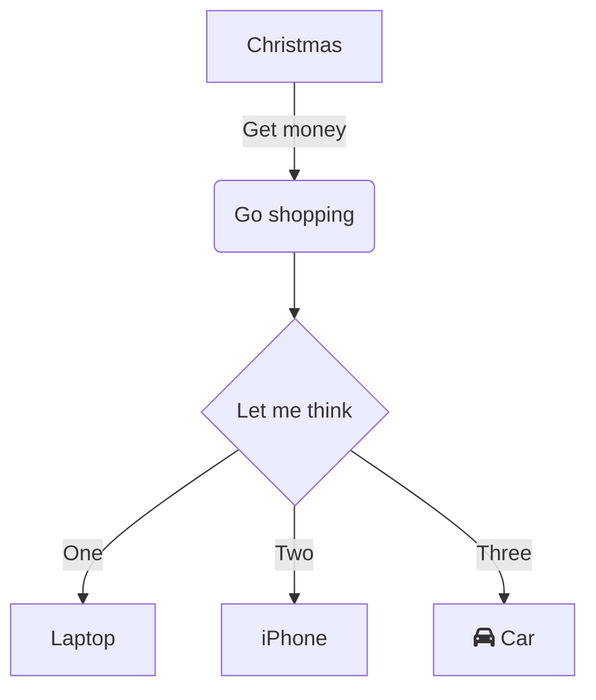

# Hello 





# Glovo

Food Delivery and More

## Table of Contents

- [Getting Started](#getting-started)
  - [Prerequisites](#prerequisites)
  - [Installation](#installation)
- [Usage](#usage)
- [Application Modules](#application-modules)
- [Middlewares](#middlewares)
- [Database Models](#database-models)
- [External Services](#external-services)
- [Utilities and Helpers](#utilities-and-helpers)
- [Documentation](#documentation)
- [API Documentation](#api-documentation)
- [Configuration](#configuration)
- [Contributing](#contributing)
- [License](#license)

## Getting Started

Provide instructions on how to set up and run your Node.js project. Include details about prerequisites and installation.

### Prerequisites

List any software, tools, or dependencies that need to be installed before running the project.

### Installation

A step-by-step guide on how to install and set up your project. You can use code blocks for commands.

```bash
npm install
```

## Usage

Explain how to use your project, including code examples and demonstrations.

## Application Modules

Modules handling core application functionalities


### Authentication
Handles user authentication and authorization.

### Orders
Manages user orders and deliveries.

### Payments
Handles payment processing for orders.

### Notifications
Sends push notifications to users.

## Middlewares

Middleware components are used for processing requests, error handling, and input validation. Routing modules define API endpoints and route handlers.


### Authentication Middleware
Verifies user authentication for protected routes.

### Error Handling Middleware
Handles errors and returns appropriate error responses.

### Input Validation Middleware
Validates input data for requests.

### API Routing
Defines API endpoints and their respective route handlers.

## Database Models

This group includes database models representing the various entities in the app. It also covers database queries for data retrieval and manipulation.


### User Model
Represents a user in the database.

### Order Model
Represents an order in the database.

### Payment Model
Represents a payment in the database.

### Notification Model
Represents a notification in the database.

## External Services

Modules for integrating external services such as payment gateways, geocoding services, push notification services, etc.


### Payment Gateway
Integrates with a third-party payment gateway for processing payments.

### Push Notification Service
Integrates with a push notification service to send notifications to users.

## Utilities and Helpers

Modules containing utility functions and third-party libraries used for specific functionality.


### Date Utils
Provides utility functions for working with dates and times.

### String Utils
Provides utility functions for manipulating strings.

### Error Handling Helpers
Provides helper functions for handling errors.

## Architecture

This module group is responsible for creating and maintaining documentation for the application's API, making it easier for developers to understand how to use the API endpoints.

```mermaid

```


## API Documentation

If your project includes an API, provide a link to the API documentation or explain how to access it.

## Configuration

Explain how to configure your project, including any environment variables or configuration files.

## Contributing

Provide guidelines for contributors, including how to report issues, submit pull requests, and code formatting conventions.

## License

This project is licensed under the [License Name](LICENSE) - see the [LICENSE](LICENSE) file for details.
